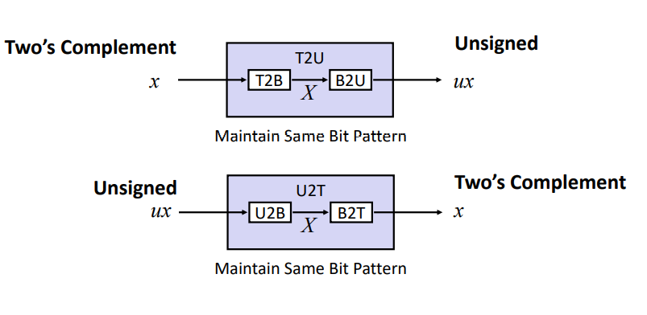

# CMU15-213深入理解计算机系统

# Lecture 02 Bits,Bytes, and lnteger

## 数据类型

### 数据类型占用字节大小

| C Data Type | Typical 32-bit | Typical 64-bit |
| ----------- | -------------- | -------------- |
| char        | 1              | 1              |
| short       | 2              | 2              |
| int         | 4              | 4              |
| long        | 4              | 8              |
| float       | 4              | 4              |
| double      | 8              | 8              |
| pointer     | 4              | 8              |


## 按位运算符

### 需要区分逻辑运算符和按位逻辑运算符

逻辑及运算符：&&，|| ，! 

按位逻辑运算符: &（与），|（或），~（取反），^(异或)，左移(<<)，右移(>>)

##### tip:以及安慰逻辑运算符可以复合运算，如:  a&=b;

##### tip:在使用指针前，可以用p && *p来提前判断是否为空指针。

x==y <=> !(x^y)

### 无符号数

#### 范围表示

$UMin = 0$ ~ $UMax = 2^w -1$，w为字长。

$UMax= 2|Tmax|+1$ 

### 有符号数

#### 范围表示

$TMin=-2^{w-1}$ ~ $TMax = 2^{w-1} -1$，w为字长。

$|Tmin|-1=|TMax|$。

$-1 = 1111\ \ 1111$此处为8位。

当只有符号位为1时，此时的数最小$-2^{w-1}$。



#### 正数和负数

##### 正数

$\sum_{i=1}^{n}2^i$

正数的补码是本身。

##### 负数

负数通常以补码形式表示。

负数在补码形式下计算方式：$-x_{w-1}·2^{w-1}为最高位符号位+剩余位数(\sum_{i=0}^{w-2}x_i·2^i)=负数$

换句话说：**负数与它的绝对值下的正数互为补码**。 -1与|1|互为补码。

使用一下代码可进行有符号与符号的转换调试加深理解

```c
#include<stdio.h>
int main() {
	unsigned char b = 128; //128U = -128 255U = -1
	printf(" % d", (char)b);
	
}
```


### 在C语言中，需要注意有符号数和无符号数的处理

一般来说，有符号与无符号数进行运算后为无符号数。

需要注意无符号数，作循环变量时，需要注意，如下：

```c
#define len 10
unsinged int i = len;
for (;i<=0;i--);
    //此循环是无法正常结束的,当i=0时，再自减后，因为是无符号数，本应是-1的它，转为2^w-1。

```


### 二进制位数扩展或缩短

#### 扩展位数

从4位扩展到8位二进制位：0001 --> 0000 0001

#### 缩短位数

公式:原数值(原数值为负数时，需转为无符号数) % 最高符号位数值 = 取余(且该结果需要转为有符号数)。


### tips:汇编

#### 传递参数

**寄存器用途约定**

用于存储传入参数：`%rdi`、`%rsi`、`%rdx`、`%rcx`、`%r8`、`%r9`，共计 6 个。
用于存放返回结果：`%rax`。

段寄存器
段是一种内存保护技术，他把内存划分为多个区段，并为每个区域富裕起始地址、范围、访问权限等，以保护内存。此外，他还同分页技术一起用于虚拟内存变更为实际物理内存。段内存记录在sdt（段描述符表）中，而段寄存器就持有这些sdt的索引。

CS：代码段寄存器
SS：栈段寄存器
DS：数据段寄存器
ES：附加（数据）段寄存器
FS：数据段寄存器
GS：数据段寄存器

`%`是寄存器，如`%edx`；
`$`是常量，比如`$0x1`;
`()`是内存，比如`(%edx)`；